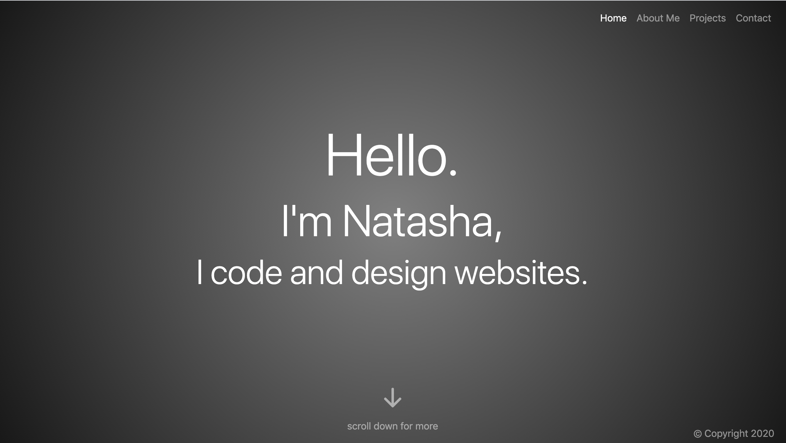

# Online-Portfolio
A portfolio of my work so far.

## Table of Contents
1. [ Description ](#desc)
2. [ Visuals ](#visuals)
3. [ Deployed Webpage ](#deployed)
4. [ Support ](#support)
5. [ Next Steps ](#next_steps)
6. [ Authors and Acknowledgement ](#acknowledge)
7. [ License ](#license)

## 1. Description
This portfolio will eventually contain several projects completed during my time at the [University of Toronto School for Continuing Studies Coding Bootcamp](https://bootcamp.learn.utoronto.ca/). It also contains a brief **about me** section and a **contact me** form.

##### Note:
Rather than having several pages that link to each other, I used [scrollspy](https://getbootstrap.com/docs/4.0/components/scrollspy/) (by Bootstrap) to have the links be scrolled to. This was a stylistic change that I think makes my portfolio more on trend.

### Summary of Entries

#### Refactored Website (Horiseon Marketing)
A refactored webpage made for fictional SEO company Horiseon. Only semantic and very limited functional changes were made.

#### Online portfolio website 
Right now, because I have very limited entries, I have included this website. I will remove this once I have more entries.

#### Password Generator
This password generator, still to be created at this time, creates strong passwords according to the types (i.e. uppercase, lowercase, numeric, special) of characters the user would like. The character types are entered by the user. Because this project has yet to be completed, there is a link to an *"Under construction"* site.

## 2. Visuals
Screenshot of the webpage:

## 3. Deployed Webpage
[The deployed site](https://tasha876.github.io/Online-Portfolio/), hosted by GitHub Pages.

## 4. Support
Should you find an issue with this webpage, please create a [new issue](https://github.com/Tasha876/Online-Portfolio/issues/new/choose) on my GitHub repository.

## 5. Next steps
This portfolio is an ongoing project. Some next steps include:
* adding the password generator,
* adding larger thumbnails and finding a way to make larger thumbnails work with the design,
* adding more interativity such as a [full screen scroller](https://mdbootstrap.com/previews/docs/latest/html/fsscroller/extended.html#view-2),
* adding many more projects.

## 6. Authors and Acknowledgement
This site was created entirely by Natasha Fray using the [Bootstrap](https://getbootstrap.com/) framework.

## 7. License
This project is covered by the [MIT](LICENSE) license.

